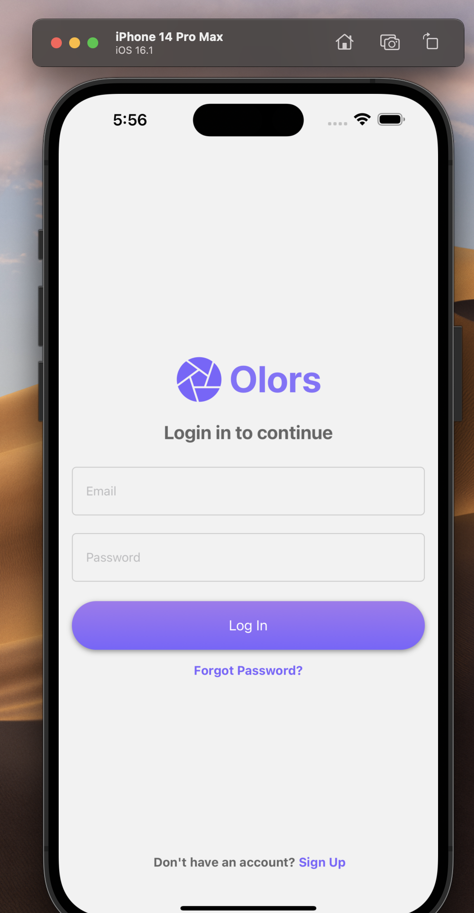
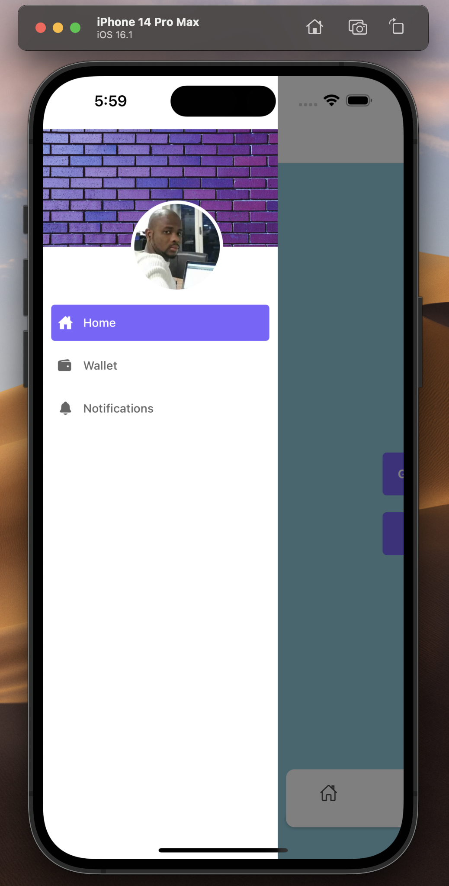
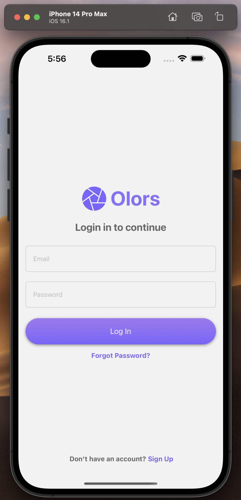
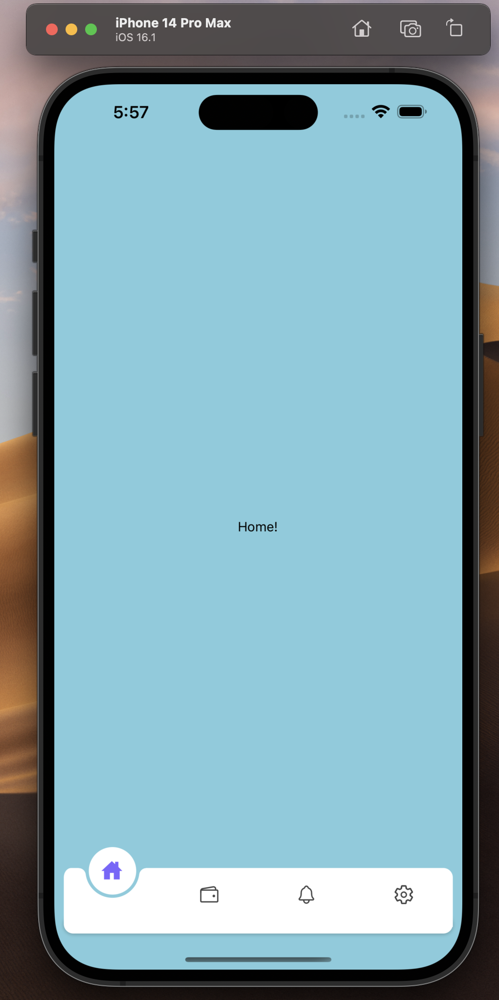
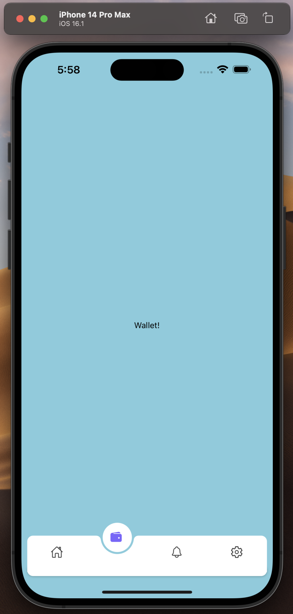
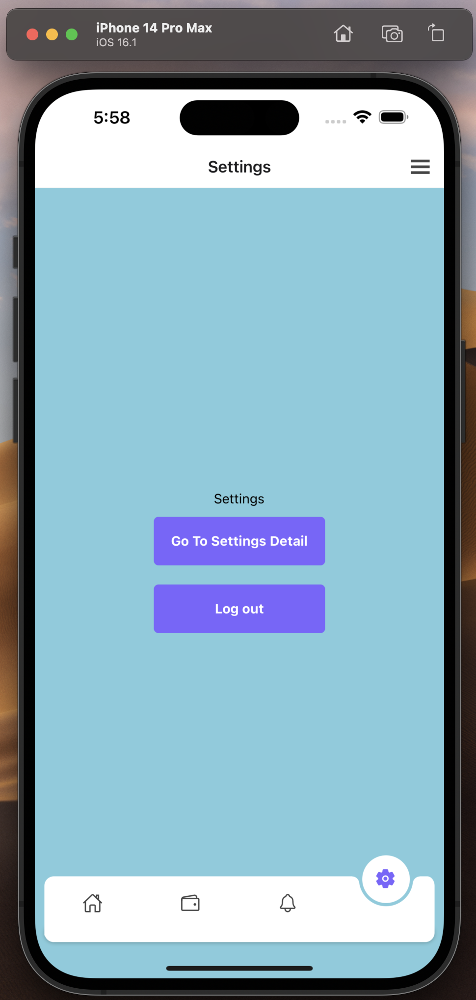

### React Navigation v6 Tutorial for beginners | Custom Tab and custom drawer Navigators [All in 1]
Welcome to react navigation v6 crash course and in this tutorial you will learn how to implement react navigation v6 in your react native mobile applications, create react navigation bottom tab navigator, react navigation drawer navigator and create custom bottom tab and drawer navigators.

### `screenShot`

### `IOS`

